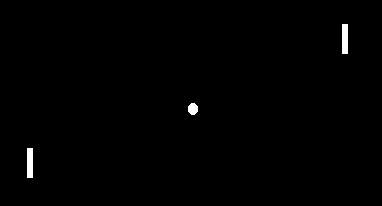
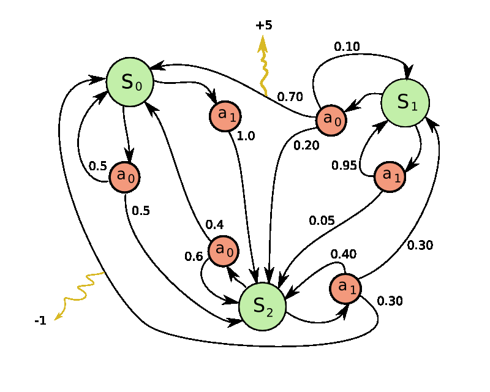
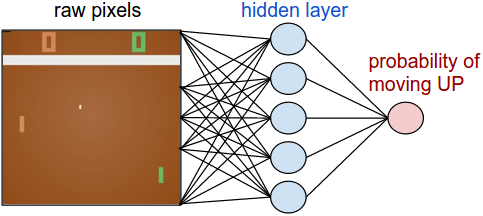
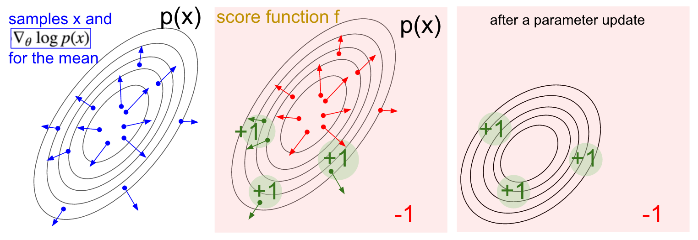
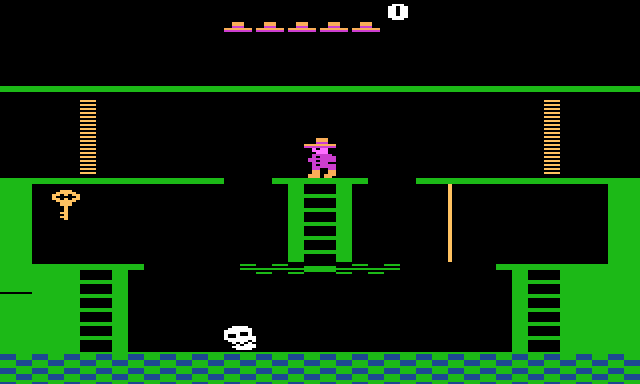
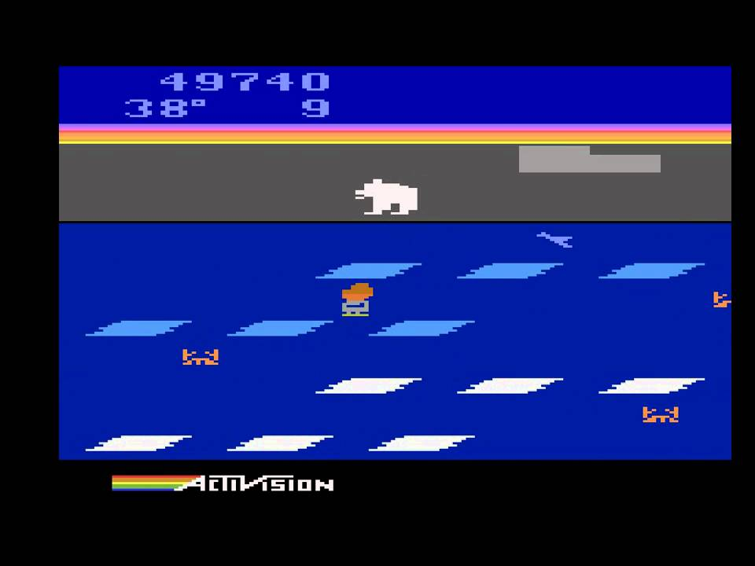

原文： http://karpathy.github.io/2016/05/31/rl/ 

作者：Andrej Karpathy

翻译：[@Chen Quan](https://github.com/chenquan )

# 深度强化学习：Pongs from Pixels

这是有关“强化学习”（RL）的早就应该发表的博客文章。RL很热！您可能已经注意到，计算机现在可以自动[学习玩ATARI游戏](http://www.nature.com/nature/journal/v518/n7540/abs/nature14236.html)（从原始游戏像素开始！），它们在[Go](http://googleresearch.blogspot.com/2016/01/alphago-mastering-ancient-game-of-go.html)（译者注：Alpha Go）上击败了世界冠军，模拟的四足动物正在学习[奔跑和跳跃](https://www.cs.ubc.ca/~van/papers/2016-TOG-deepRL/index.html)，机器人正在学习如何执行[复杂的操纵任务](http://www.bloomberg.com/features/2015-preschool-for-robots/)，违了显式编程。事实证明，所有这些进展都属于RL研究的范畴。在过去的一年中，我自己也对RL产生了兴趣：我研究了[Richard Sutton的书](https://webdocs.cs.ualberta.ca/~sutton/book/the-book.html)，阅读了[David Silver的课程](http://www0.cs.ucl.ac.uk/staff/d.silver/web/Teaching.html)，观看了[John Schulmann的演讲](https://www.youtube.com/watch?v=oPGVsoBonLM)，[用Javascript](http://cs.stanford.edu/people/karpathy/reinforcejs/)编写的[RL库](http://cs.stanford.edu/people/karpathy/reinforcejs/)，整个夏天，在DeepMind的DeepRL小组实习，最近又在新RL基准测试工具包[OpenAI Gym](https://gym.openai.com/)的设计/开发投入了一些[精力](https://gym.openai.com/)。因此，我肯定已经从事了至少一年，但直到现在我还没有写一篇简短的文章来介绍RL为何如此重要，它的意义，发展的方式以及发展的方向去。


疯狂RL的例子。**从左到右**：深度Q学习网络播放ATARI，AlphaGo，伯克利机器人堆叠的乐高积木，物理模拟的四足动物跨越地形。

反思RL近期进展的性质很有趣。我大致想考虑阻碍AI的四个独立因素：

1. 计算（显而易见的一个：摩尔定律，GPU，ASIC），
2. 数据（一种很好的形式，而不仅仅是Internet上的某个地方，例如ImageNet），
3. 算法（研究和思路，例如backprop，CNN，LSTM）和
4. 基础架构（您之下的软件-Linux，TCP / IP，Git，ROS，PR2，AWS，AMT，TensorFlow等）。

与“计算机视觉”中发生的情况类似，RL的进步并没有像你可能期望的被那些令人惊奇的想法推动。在《计算机视觉》中，2012年的AlexNet主要是1990年代ConvNets的放大版本（更深更宽）。同样，2013年发布的ATARI深度Q学习论文是一种标准算法的实现（带函数逼近的Q学习，您可以在Sutton 1998的标准RL书中找到），其中函数逼近器恰好是ConvNet。AlphaGo将策略梯度与蒙特卡洛树搜索（MCTS）结合使用-这些也是标准组件。当然，要使其运作，需要大量的技巧和耐心，并且在旧算法的基础上已经开发出了许多巧妙的调整，

现在回到RL。每当看起来神奇的东西和它的内幕多么简单之间存在脱节时，我都会感到非常恼火，并且让我真的想写一篇博客文章。在这种情况下，我见过很多人，他们不敢相信我们可以通过一种算法，通过像素，从头开始使用一种算法来自动学习玩人类级别的大多数ATARI游戏-太神奇了，我体会过！但从根本上讲，我们使用的方法实际上也非常愚蠢（尽管我知道回想起来很容易得出这样的主张）。无论如何，我想带您了解Policy Gradients（PG），这是我们目前最喜欢的解决RL问题的默认选择。如果您来自RL以外的地方，您可能会很好奇为什么我不介绍DQN，它是一种替代的且知名度更高的RL算法，已被RL广泛使用[ATARI游戏纸](http://www.nature.com/nature/journal/v518/n7540/abs/nature14236.html)。事实证明，Q学习不是一个很好的算法（您可以说DQN在2013年是如此（好吧，我有一半是开玩笑的）。实际上，大多数人都喜欢使用Policy Gradients，包括原始DQN论文的作者，他们在调优后[显示](http://arxiv.org/abs/1602.01783) Policy Gradients比Q Learning更好地工作。首选PG，因为它是端到端的：有一个明确的政策和一种有原则的方法可以直接优化预期的回报。无论如何，作为一个正在运行的示例，我们将学习使用PG，从头开始，从像素开始，通过深度神经网络来玩ATARI游戏（Pong！），整个过程是仅使用numpy作为依赖项的130行Python（[要点链接](src/pg-pong.py)）。让我们开始吧。

### 像素球



 



**左：**乒乓球比赛。**右图：** Pong是[Markov决策过程（MDP）](https://en.wikipedia.org/wiki/Markov_decision_process)的特例：一个图形，其中每个节点都是特定的游戏状态，每个边缘都是可能的（通常是概率性的）过渡。每条边都给与奖励，目标是计算在任何状态下的最佳行为方式，以使奖励最大化。

Pong的游戏是简单的RL任务的一个很好的例子。在ATARI 2600版本中，我们将使用您作为球拍之一（另一个由不错的AI控制），并且您必须将球弹回另一位球员（我真的不必解释Pong，对吗？ ）。在低端，游戏的工作方式如下：我们收到一个图像帧（一个`210x160x3`字节数组（从0到255的整数，给出像素值）），然后我们决定是否要向上或向下移动操纵杆（即二进制选择） ）。每次选择后，游戏模拟器都会执行动作并给予我们奖励：如果球超过了对手，则为+1奖励；如果我们错过球，则为-1奖励；否则为0。当然，我们的目标是移动球拍，以便获得很多回报。

在进行解决方案时，请记住，我们将对Pong做出很少的假设，因为我们暗中并不真正关心Pong。我们关心复杂的高维问题，例如机器人操纵，组装和导航。Pong只是一个有趣的玩具测试用例，我们在研究如何编写非常通用的AI系统（可以一天完成任意有用的任务）的过程中使用。

**策略网络**。首先，我们将定义一个实施我们的播放器（或“代理”）的*策略网络*。该网络将获取游戏状态，并决定我们应该做什么（向上或向下移动）。作为我们最喜欢的简单计算模块，我们将使用一个2层神经网络，该网络获取原始图像像素（总共100,800个数字（210 * 160 * 3）），并生成一个表示上升概率的数字。请注意，使用*随机*策略是标准做法，这意味着我们只会产生向上移动的*可能性*。每次迭代，我们将从该分布中采样（即扔一个有偏差的硬币）以获得实际的移动。一旦我们讨论训练，为什么这样做的原因将会更加清晰。



我们的策略网络是2层全连接网络。

并在此处具体说明如何在Python / numpy中实现此策略网络。假设我们得到了一个`x`保存（预处理）像素信息的向量。我们将计算：

```python
h = np.dot(W1, x) # compute hidden layer neuron activations
h[h<0] = 0 # ReLU nonlinearity: threshold at zero
logp = np.dot(W2, h) # compute log probability of going up
p = 1.0 / (1.0 + np.exp(-logp)) # sigmoid function (gives probability of going up)
```

在此代码段中`W1`，`W2`是我们随机初始化的两个矩阵。我们没有使用阈值(biases)，因为 meh 。请注意，我们在最后使用了*S形*非线性，将输出概率压缩到范围[0,1]。直观地讲，隐藏层中的神经元（权重沿的行排列的`W1`）可以检测各种游戏场景（例如，球在顶部，我们的球拍在中间），然后权重`W2`可以确定是否在每种情况下，我们都应该向上或向下。现在，初始随机`W1`和`W2`会造成玩家当场痉挛。因此，现在唯一的问题就是寻找`W1`和`W2`导致Pong的专家级比赛！

*精细印刷：预处理。*理想情况下，您希望将至少2个帧馈送到策略网络，以便它可以检测到运动。为了使事情变得更简单（我在Macbook上进行了这些实验），我将做一些预处理，例如，我们实际上会将*差异帧*馈送到网络（即减去当前帧和最后一帧）。

**听起来是不可能的**。在这一点上，我希望您了解RL问题有多么困难。我们得到100,800个数字（210 * 160 * 3），并前向传播我们的策略网络（这很容易涉及到对一百万的参数顺序`W1`和`W2`）。假设我们决定上升。游戏可能会回应，这一次我们将获得0奖励，并为下一帧再提供100,800个数字。在获得任何非零奖励之前，我们可以重复此过程一百个时间步！例如，假设我们最终得到+1。太好了，但是我们怎么知道是什么原因导致的呢？这是我们刚才所做的吗？还是76帧前？还是与第10帧，是第90帧有关？为了将来做得更好，我们如何找出百万个旋钮中的哪一个以及如何更改？我们称此为*信用分配问题*。在Pong的特定情况下，我们知道如果球越过对手，我们将获得+1。在*真正*原因是我们碰巧以良好的轨迹弹跳球，但实际上我们之前做过很多帧-例如，在Pong的情况下大概是20帧，此后我们执行的每一个动作对我们是否结束都无效得到奖励。换句话说，我们面临着一个非常棘手的问题，情况看起来非常昏暗。

**监督学习**。在我们深入探讨Policy Gradients解决方案之前，我想简短地提醒您有关监督学习的知识，因为正如我们将看到的那样，RL非常相似。请参考下图。在普通的有监督的学习中，我们会将图像馈送到网络并获得一些概率，例如对于UP和DOWN两类。我显示的是UP和DOWN的对数概率（-1.2，-0.36），而不是原始概率（在这种情况下为30％和70％），因为我们总是优化正确标签的对数概率（这使数学更好，并且等效于优化原始概率，因为对数是单调的。现在，在监督学习中，我们将可以访问标签。例如，我们可能被告知当前正确的操作是向上运动（标签0）。在一个实现中，我们将以UP的对数概率输入1.0的梯度，然后运行backprop来计算梯度矢量$ \nabla_{W} \log p(y=UP \mid x)$ `0.001``2.1 * 0.001` 

**策略梯度**。好的，但是如果我们在“强化学习”设置中没有正确的标签，该怎么办？这是“策略梯度”解决方案（再次参考下图）。我们的策略网络计算出上升为30％（logprob -1.2）和下降为70％（logprob -0.36）的概率。现在，我们将从该分布中采样一个动作；例如，假设我们采样DOWN，然后在游戏中执行它。此时，请注意一个有趣的事实：我们可以像在监督学习中一样立即为DOWN填充1.0的渐变，并找到将鼓励网络将来更有可能执行DOWN动作的渐变矢量。因此，我们可以立即评估此梯度，这很好，但是问题在于，至少到目前为止，我们尚不知道下降是好的。但关键是没关系，因为我们可以稍等一下看看！例如，在Pong中，我们可以等到游戏结束，然后获取我们获得的奖励（如果我们赢了，则奖励+1；如果我们输了，则奖励-1），然后输入该标量作为我们采取的动作的梯度（在这个案例中是DOWN）。在下面的示例中，下降导致我们输掉了游戏（-1奖励）。因此，如果为DOWN的对数概率填写-1并进行反向传播，我们将发现一个梯度*不鼓励*网络将来为该输入采取DOWN动作（正确的做法是，因为采取该动作导致我们输掉了比赛）。


就是这样：我们有一个随机策略，对行动进行抽样，然后在将来会鼓励最终会导致良好结果的行动受到鼓励，而导致不良结果的行动则受到挫败。另外，如果我们最终赢得比赛，奖励甚至不必为+1或-1。它可以是某种最终质量的任意度量。例如，如果情况确实很好，则可能是10.0，然后我们将其输入为梯度而不是-1，以开始反向传播。那就是神经网络的美。使用它们就像是作弊：您可以在1万亿次的计算中嵌入100万个参数，并且可以使用SGD使其做任意事情。它不应该起作用，但是有趣的是，我们生活在它起作用的宇宙中。

**训练规则。**因此，这是训练的详细工作方式。我们将使用一些初始化策略网络`W1`，`W2`并玩100个Pong游戏（我们称这些策略为“推广”）。让我们假设每个游戏都由200帧组成，因此我们总共做出了20,000个向上或向下决策，对于其中每一个,我们都知道参数梯度，这告诉我们,如果我们想要改变参数，鼓励将来在该状态做改做的决定。现在剩下的就是将我们所做的每个决定贴上好坏的标签。例如，假设我们赢了12场比赛而输了88场。我们将对获胜游戏做出的所有200 * 12 = 2400个决定进行一次积极的更新（为示例动作填充梯度为+1.0，进行反向执行，和参数更新鼓励我们在所有这些州采取的行动）。然后，我们将在输掉的游戏中做出其他200 * 88 = 17600个决定，并进行消极的更新（使我们所做的一切变得模糊）。而且...就是这样。现在，网络将更有可能重复执行有效的操作，而不太可能重复执行无效的操作。现在，我们通过略有改进的新政策又玩了100场游戏，并进行冲洗和重复。

> 策略梯度：运行策略一段时间。看看哪些行为导致了高额回报。增加他们的可能性。


4个游戏的卡通图。每个黑色圆圈是游戏状态（底部显示了三个示例状态），每个箭头都是过渡状态，并带有采样的动作。在这种情况下，我们赢了2场，输了2场。使用Policy Gradients，我们将赢得两场比赛，并稍微鼓励我们在那集中进行的每个动作。相反，我们也将丢掉的两局游戏，并稍微劝阻我们在该集中进行的每项操作。

如果您认为通过此过程，您将开始发现一些有趣的属性。例如，如果我们在第50帧采取了良好的动作（正确地将球弹回），但随后在第150帧错过了球怎么办？如果现在将每个动作都标记为不良（因为我们输了），那会不会阻碍第50帧的正确弹跳？您是对的-的确如此。但是，当您考虑成千上万的游戏过程时，正确地进行第一次跳出会让您更有可能赢得胜利，因此平均而言，对于正确的跳出和策略，您会看到比消极更新更积极的信息最终会做正确的事。

 **更新：2016年12月9日-替代视图**。在上面的说明中，我使用了诸如“填充渐变和反向传播”之类的术语，如果您习惯于编写自己的反向传播代码，或者使用渐变明显且开放的Torch，则我意识到这是一种特殊的思考方式。修补。但是，如果您习惯使用Theano或TensorFlow，您可能会有些困惑，因为代码围绕指定的损失函数而编排，并且反向执行是全自动的，很难修改。在这种情况下，以下替代视图可能更直观。在香草监督学习中，目标是使$\sum_ilogp(y_i|x_i)$最大化其中$x_i,y_i$是训练的样本(例如图片及其标签)。策略梯度与监督学习完全相同，但有两个小区别：1）我们没有正确的标签$y_i$因此，作为“假标签”，我们替换了在看到$x_i$时从策略中采样的操作2）我们基于最终结果对每个示例的损失进行乘法调整，因为我们希望增加有效措施的对数概率，而对无效措施则减少对数概率。综上所述，我们的损失现在看起来像$\sum_iA_ilogp(y_i|x_i)$，其中$y_i$是我们碰巧要采样的动作，$A_i$是一个我们称为**优势**的数字。以Pong为例，例如，如果我们最终在包含$x_i$的插曲（译者注:训练或游戏）中获胜，则为1.0；如果我们输了，则为-1.0。这将确保我们最大程度地提高带来良好结果的行为的对数概率，并最小化那些未带来结果的行为的对数概率。因此，强化学习与监督学习完全相同，但是在不断变化的数据集（情节）上，优势得到了扩展，我们只希望基于每个采样数据集进行一次（或很少）更新 。

 **更一般的优势函数**。我还答应了对收益进行更多的讨论。到目前为止，我们已经判断*善良*基于我们是否赢得比赛每一个人的行动。在更一般RL的设置中，在每个时间步我们会得到一定的奖励$r_t$。一种常见的选择是使用折扣奖励，因此上图中的“最终奖励”将变为$ R_t = \sum_{k=0}^{\infty} \gamma^k r_{t+k} $，其中$r$是介于0和1之间的数字，称为折现因子（例如0.99）。该表达式，我们鼓励采取抽样操作的力量来源是事后所有奖励的加权总和，但后来的奖励却没有那么重要。在实践中，标准化这些也很重要。例如，假设我们计算$R_t$在上述100次Pong游戏推出（译者注：指：向边线跑动传球(指和争球线平行的边线)）中有20,000次操作，一个好主意是在将它们喂入反向传播器之前，“标准化”这些返回值（例如，减去均值，除以标准差）。这样，我们总是会鼓励并阻止大约一半的已执行操作。在数学上，您也可以将这些技巧解释为控制策略梯度估算器的方差一种方式。在[这里](http://arxiv.org/abs/1506.02438)可以找到更深入的探索。 

 **推导策略梯度**。我还要概述一下“策略梯度”在数学上的来源。策略梯度是一个更通用的*得分函数梯度估计器*的特例。一般情况是，当我们有一个形式为$E_{x \sim p(x \mid \theta)} [f(x)]$的表达式，即：某些标量值得分函数f的期望$f(x)$在某个概率分布$p(x;\theta)$下p（X;θ）由某个$\theta$参数化。提示$f(x)$将成为我们的奖励函数（或更普遍地讲是优势函数）和$p(x)$将是我们的政策网络，这实际上是$p(a|I)$的模型，给出任何图像所应付的动作分布$I$。然后我们感兴趣于去寻找如何改变分布（通过其参数$\theta$），以提高其样本的得分（由$f$判断）（即，我们如何更改网络参数，以便使行动样本获得更高的回报）。我们有： 
$$
\begin{align}
\nabla_{\theta} E_x[f(x)] &= \nabla_{\theta} \sum_x p(x) f(x) & \text{definition of expectation} \\
& = \sum_x \nabla_{\theta} p(x) f(x) & \text{swap sum and gradient} \\
& = \sum_x p(x) \frac{\nabla_{\theta} p(x)}{p(x)} f(x) & \text{both multiply and divide by } p(x) \\
& = \sum_x p(x) \nabla_{\theta} \log p(x) f(x) & \text{use the fact that } \nabla_{\theta} \log(z) = \frac{1}{z} \nabla_{\theta} z \\
& = E_x[f(x) \nabla_{\theta} \log p(x) ] & \text{definition of expectation}
\end{align}
$$
 用英语来说，我们有一些分布$p(x:\theta)$（为了减少混乱我用$p(x)$简写），我们可以从中采样（例如，高斯）。对于每个样本，我们还可以评估得分函数$f$，取样并返回给我们一些标量值。如果我们希望其样本达到较高的得分（由$f$判断）这个方程将告诉我们如何改变分布（通过其参数$\theta$）来实现。特别是，它看起来像：画一些样本$x$，评估他们的分数$f(x)$，并且评估每个$x$的第二项$\nabla_{\theta} \log p(x;\theta)$。第二项是什么？它是一个向量——梯度为我们提供了参数空间中的方向，从而促使分配给$x$的概率增加。换句话说，如果我们要微移$\theta$朝$\nabla_{\theta} \log p(x;\theta)$我们将看到分配给某些$x$的新概率略有增加。如果您回头看一下公式，它告诉我们应该朝这个方向并乘以标量值分数$f(x)$。这样一来，得分较高的样本就会比那些得分较低的样本更强地“拖拉”概率密度，因此，如果我们要根据$p$上的几个样本进行更新，则概率密度将朝着较高得分的方向移动，从而使得分较高的样本更有可能出现。 



得分函数梯度估计器的可视化。

**左**：一个高斯分布和一些样本（蓝点）。在每个蓝点上，我们还绘制了对数概率相对于高斯平均参数的梯度。箭头指示应微调分布平均值以增加该样本概率的方向。**中**：某些评分函数的叠加，在某些小区域中除+1之外，其他所有地方都提供-1（请注意，这可以是任意的，不一定是可微分的标量值函数）。现在，这些箭头已进行了颜色编码，因为由于更新中的乘法，我们将平均所有绿色箭头和红色箭头的*负数*。**右**：在参数更新后，绿色箭头和反向红色箭头将我们向左移至底部。现在，根据需要，此分布中的样本将具有更高的预期分数。

我希望与RL的连接是清晰的。我们的策略网络为我们提供了行动样本，其中一些样本的效果比其他样本更好（根据优势函数判断）。这个小小的数学运算告诉我们，更改策略参数的方法是进行一些部署，采用采样操作的梯度，将其乘以分数并添加所有内容，这就是我们上面所做的。有关更详尽的推论和讨论，我建议[约翰·舒尔曼（John Schulman）的演讲](https://www.youtube.com/watch?v=oPGVsoBonLM)。

**学习**。好了，我们已经开发出了针对梯度变化的直觉，并看到了其推导的草图。我在[130行Python脚本中](https://gist.github.com/karpathy/a4166c7fe253700972fcbc77e4ea32c5)实现了整个方法，该[脚本](https://gist.github.com/karpathy/a4166c7fe253700972fcbc77e4ea32c5)使用[OpenAI Gym](https://gym.openai.com/)的ATARI 2600 Pong。我使用RMSProp在10集的批次中训练了一个具有200个隐藏层单元的2层策略网络（每集是几十场游戏，因为每个玩家的游戏得分都达到21）。我没有对超参数进行过多的调整，而是在（慢速）的Macbook上进行了实验，但是经过3个晚上的训练，我最终制定了比AI玩家更好的策略。总集数约为8,000，因此该算法大约播放了200,000 Pong游戏（不是很多！），总共进行了约800次更新。朋友告诉我，如果您使用ConvNets在GPU上训练几天，则可以更频繁地击败AI玩家，并且如果您还仔细优化了超参数，那么您也可以始终称霸AI玩家（即，赢得每场比赛）。然而：(*下面是YouTube的视频连接，暂时无法提供*)

<iframe width="420" height="315" src="https://www.youtube.com/embed/YOW8m2YGtRg?autoplay=1&amp;loop=1&amp;rel=0&amp;showinfo=0&amp;playlist=YOW8m2YGtRg" frameborder="0" allowfullscreen="" style="margin: 0px; padding: 0px;"></iframe>
博学的特工（绿色，右）与硬编码的AI对手（左）对峙。

**学到的权重。我们还可以看一下学习到的权重。由于进行了预处理，因此每个输入都是80x80的差异图像（当前帧减去最后一帧）。现在，我们可以将`W1`，将它们拉伸到80x80并可视化。以下是网格中40个（200个中的）神经元的集合。白色像素为正权重，黑色像素为负权重。请注意，几个神经元已调整到弹跳球的特定痕迹，并沿直线交替黑白编码。球只能位于单个位置，因此这些神经元是多任务处理的，将沿着该线“射击”球的多个位置。黑白交替很有趣，因为当球沿着轨迹移动时，神经元的活动将以正弦波的形式波动，并且由于ReLU，它将沿轨迹的离散位置分开“发射”。图像中有些噪点，我认为如果使用L2正则化可以消除这种噪点。


### 什么都没发生

这样就可以了-我们从使用Policy Gradients的原始像素开始学习Pong，并且效果很好。该方法是一种花哨的猜想检查形式，其中“猜测”是指从我们当前策略中推出的样本，而“检查”是指鼓励采取可导致良好结果的行动。取一些细节，这代表了我们当前如何处理强化学习问题的最新技术。我们可以学习这些行为，这给人留下了深刻的印象，但是如果您直观地理解了算法，并且知道它是如何工作的，那么您至少应该会有些失望。特别是它怎么不起作用？

将其与人类学习打乒乓球的方式进行比较。您向他们展示游戏并说出类似的话：“您控制着球拍，您可以上下移动球拍，而您的任务是将球反弹到AI所控制的另一位球员身上“。重新设置并准备出发。请注意其中的一些区别：

- 在实际环境中，我们通常以某种方式（例如上面的英语）传达任务，但是在标准的RL问题中，您假设必须通过环境交互来发现任意奖励函数。可以说，如果一个人参加了Pong游戏，但是不了解奖励函数（的确如此，特别是如果奖励函数是一些静态但随机的函数），那么该人将很难学习如何做，但是对应策略梯度这将变得无关紧要，并且效果可能会更好。同样，如果我们拍摄帧并随机排列像素，那么人类可能会失败，但是我们的Policy Gradient解决方案甚至无法分辨出差异（如果它使用的是完全连接的网络，如此处所述）。
- 人类会带来大量的先验知识，例如直观的物理学（球反弹，不可能传送，不可能突然停止，保持恒定的速度等），以及直观的心理学（AI对手“想要”获胜，很可能遵循明显的向球等策略）。您还了解了“控制”板的概念，并且它可以响应您的UP / DOWN键命令。相比之下，我们的算法从头开始，这同时令人印象深刻（因为它有效）和令人沮丧（因为我们缺乏如何避免这种现象的具体想法）。
- 策略梯度是一种*蛮力*解决方案，最终可以找到正确的操作并将其内化到策略中。人类在其中建立一个丰富的抽象模型和计划。在Pong中，我可以断定对手的速度非常慢，因此以较高的垂直速度弹跳球可能是一个不错的策略，这会使对手无法及时赶上球。但是，似乎我们最终还是将良好的解决方案“内在化”，使之看起来更像是一种反应性的肌肉记忆政策。例如，如果您正在学习一个新的汽车任务（例如，用变速杆驾驶汽车？），您通常会在一开始思考得很多，但最终该任务变得自动而漫不经心（译者注：指的是新手学开车的时候都会东想西想，但是到最后开车就变成下意识行为了）。
- 策略梯度人员必须实际体验到积极的回报，并且要经常体验它，以便最终慢慢地将策略参数转移到重复的获得高回报的举动上。利用我们的抽象模型，人们可以找出可能给出奖励的东西，而无需实际经历过奖励或不奖励的过渡。在我开始逐渐避免撞车之前，我没有必要经历几次撞车撞墙的经历。



 



**左（上）：**蒙特祖玛的复仇：我们的RL算法难度很大的游戏。玩家必须跳下，爬上，拿到钥匙并打开门。人们知道获取密钥是有用的。计算机对数十亿次随机移动进行采样，并且有99％的时间掉到了它的死亡或被怪物杀死。换句话说，很难“偶然发现”有利的局面。**右（下）：**另一个困难的游戏叫做《冰冻人》，人类可以理解事物在移动，某些事物触感良好，某些事物触感不好，目标是一砖一瓦地建造冰屋。可以在“ [像人一样学习和思考的机器”中](https://arxiv.org/abs/1604.00289)找到对该游戏的良好分析并讨论人机方法之间的差异。

相反，我还要强调一点，在许多游戏中，“策略梯度”很容易击败人类。尤其是，具有频繁奖励信号，需要精确游戏，快速反应且不需要太多长期计划的任何事物都会取得理想的效果，因为这种方法很容易“注意到”奖励和行动之间的这些短期关联。策略精心执行。您可以在我们的Pong代理中看到这种情况的提示：它制定了一种策略，先等待球，然后快速冲破以将其捕获在边缘，然后以很高的垂直速度将其快速发射。代理重复执行此策略可连续得分。在很多ATARI游戏中，深度Q学习都是以这种方式破坏了人类的基线表现，例如弹球，突破，

总之，一旦您了解了这些算法的“技巧”，就可以通过它们的优缺点进行推理。特别是，我们在构建抽象的、丰富的游戏表示形式方面远非人类，我们可以在其中进行计划并用于快速学习。有一天，一台计算机将看到一组像素并注意到一把钥匙，一扇门，然后自己想到，拿起钥匙并到达门可能是一个好主意。到目前为止，没有什么比这更接近了，要到达那里是一个活跃的研究领域。

### 神经网络中的不可微计算

我想提到与游戏无关的策略梯度的另一个有趣应用：它允许我们设计和训练具有执行不可微计算（或与不可微计算进行交互）的组件的神经网络。这个想法最初是在[Williams 1992年提出的](http://www-anw.cs.umass.edu/~barto/courses/cs687/williams92simple.pdf)，最近又被[Recurrent Model of Visual Attention](http://arxiv.org/abs/1406.6247)推广。以“ hard attention ”的名称命名，该模型以处理一系列具有低分辨率中央凹眼（由我们自己的人眼启发）的图像为背景。特别是，在每次迭代中，RNN都会接收一小幅图像并采样一个位置以供下一步查看。例如，RNN可能会查看位置（5,30），接收一小幅图像，然后决定查看（24，50），依此类推。这个想法的问题是，存在一个网络，该网络产生了下一个要看的地方的分布，然后从中寻找样本。遗憾的是，此操作不可微分，因为从直观上讲，我们不知道如果对其他位置进行采样会发生什么情况。更一般地，考虑从一些输入到输出的神经网络：


请注意，大多数箭头（蓝色）可以正常区分，但是某些表示转换也可以选择包括不可微分的采样操作（红色）。我们可以通过蓝色箭头反向传播，但红色箭头表示我们无法反向传播的依赖项。


应对政策倾斜！我们将把进行抽样的网络部分视为嵌入在更广泛网络中的小型随机策略。因此，在训练过程中，我们将制作几个样本（由下面的分支表示），然后我们鼓励最终导致良好结果的样本（在这种情况下，例如，根据最终的损失进行衡量）。换句话说，我们将像往常一样使用反向传播训练蓝色箭头所涉及的参数，但是红色箭头所涉及的参数现在将使用策略梯度独立于后向传递进行更新，从而鼓励了导致低损失的样本。最近，在[使用随机计算图](http://arxiv.org/abs/1506.05254)进行[梯度估计中](http://arxiv.org/abs/1506.05254)也很好地形式化了此想法。


**训练的内存I / O**。您还会在其他许多论文中找到这个想法。例如，一台[神经图灵机](https://arxiv.org/abs/1410.5401)有一个存储磁带，供他们读取和写入。 为了执行写操作，我们希望执行类似`m [i] = x`的操作，其中`i`和`x`由RNN控制器网络预测。但是，该操作是不可微分的，因为没有信号告诉我们如果我们要写到另一个位置`j!= i`，将会对损失造成什么影响。因此，NTM必须执行软读取和写入操作。它预测注意力分布`a`（元素在0到1之间，总和为1，并且在我们要写入的索引周围达到峰值），然后对所有i进行计算：`m [i] = a [i] * x`。现在这是可区分的，但是我们必须付出沉重的计算代价，因为我们必须触摸每个存储单元才可以写入一个位置。想象一下，如果我们计算机中的每个作业都必须触及整个RAM！ 

但是，我们可以使用策略梯度来规避此问题（理论上），就像[RL-NTM](http://arxiv.org/abs/1505.00521)一样。我们仍然可以预测注意力分布`a`，但是我们不会进行软写，而是对要写入的位置进行采样`i = sample(a);m[i] = x`。在训练期间，我们会针对一小部分进行此操作，`i`最后使最有效的分支工作更有可能。最大的计算优势在于，我们现在只需要在测试时在单个位置进行读取/写入。但是，正如本文所指出的那样，这种策略很难实现，因为必须通过采样有效地运行算法才能偶然发现这种策略。当前的共识是，PG仅在存在一些离散选择的环境中才能很好地工作，因此不会无可避免地通过巨大的搜索空间进行采样。

但是，有了Policy Gradients，并且在有大量数据/计算可用的情况下，我们原则上可以实现更大的梦想——例如，我们可以设计学习与大型不可区分的模块（例如Latex编译器）进行交互的神经网络（例如，如果您想要char-rnn生成可编译的LaTeX），SLAM系统或LQR求解器等。或者，例如，超级智能可能想要学习通过TCP / IP与Internet进行交互（这是不可区分的），以访问控制整个世界所需的重要信息。这是一个很好的例子。

### 结论

我们看到“策略梯度”是一种功能强大的通用算法，例如，我们使用原始的像素（从头开始）在[130行Python中](https://gist.github.com/karpathy/a4166c7fe253700972fcbc77e4ea32c5)训练了ATARI Pong代理。更普遍地讲，相同的算法可用于训练任意游戏的代理，并希望有一天能够解决许多有价值的现实世界控制问题。我想在结束时再添加一些注意事项：

**关于推进AI**。我们看到，该算法通过蛮力搜索工作，您首先会在周围随机晃动，并且必须偶然发现至少一次（理想情况下是反复多次），在策略分配改变其参数以重复执行负责任的操作之前，会反复出现有益的情况。我们还发现，人类在处理这些问题上的方式大不相同，在感觉上更像是快速建立抽象模型-尽管我们几乎没有涉足研究领域（尽管许多人正在尝试）。由于这些抽象模型很难（如果不是不可能）进行显式注释，因此这也是为什么最近对（无监督的）生成模型和程序归纳感兴趣的原因。

**在复杂的机器人设置中使用**。该算法不能天真地扩展到难以获得大量探索的设置。例如，在机器人环境中，一个人可能只有一个（或几个）机器人，可以实时与世界互动。正如我在本文中介绍的那样，这禁止了该算法的朴素应用。[确定性策略梯度](http://jmlr.org/proceedings/papers/v32/silver14.pdf)是旨在缓解此问题的一项相关工作-[确定性策略梯度](http://jmlr.org/proceedings/papers/v32/silver14.pdf)是使用确定性策略并直接从建模的第二个网络中获取梯度信息，而不是从随机策略中获取样本并鼓励获得更高分数的得分函数。从原理上讲，这种方法可以在具有高维度动作的环境中更加高效，在这种情况下，采样动作提供的覆盖率很差，但是到目前为止，从经验上讲，它有点难以适应。另一个相关的方法是扩大机器人技术，就像我们开始在[Google的机械臂农场](http://googleresearch.blogspot.com/2016/03/deep-learning-for-robots-learning-from.html)甚至是[Tesla的Model S + Autopilot中](http://qz.com/694520/tesla-has-780-million-miles-of-driving-data-and-adds-another-million-every-10-hours/)看到的那样。


还有一条工作线试图通过增加额外的监督来使搜索过程变得不再绝望。例如，在许多实际情况下，人们可以从人类那里获得专家的轨迹。例如，[AlphaGo](https://deepmind.com/alpha-go)首先使用监督学习来预测专家Go游戏中的人为举动，然后根据策略上的获胜的“真实”目标对最终的模仿人策略进行微调。在某些情况下，可能会有更少的专家轨迹（例如，来自[机器人远程操作](https://www.youtube.com/watch?v=kZlg0QvKkQQ)），并且有一些技术可以在[学徒学习](http://ai.stanford.edu/~pabbeel//thesis/thesis.pdf)的框架下利用这些数据。最后，如果没有人提供监督数据，则在某些情况下也可以使用昂贵的优化技术来计算，例如通过已知动态模型中的轨迹优化（例如物理模拟器中的$F=ma$），或者在学习近似局部动力学模型的情况下（如在非常有前途的“指导策略搜索”框架中看到的）。


**论PG在实践中的应用**。最后，我想做一些我希望在RNN博客文章中所做的事情。我想我可能给人的印象是RNN很神奇，可以自动处理任意顺序问题。事实是，要使这些模型正常工作可能会很棘手，需要谨慎和专业知识，而且在许多情况下也可能是一种overkill，在这种情况下，更简单的方法可以使您获得90％以上的收益。“策略梯度”也是如此。它们不是自动的：您需要大量示例，并且需要一直训练，当不起作用时很难调试。在到达火箭筒之前，应始终尝试使用BB枪。例如，在强化学习的情况下，应始终首先尝试的一个强基准是[交叉熵方法（CEM）](https://en.wikipedia.org/wiki/Cross-entropy_method)一种受到进化启发的简单随机爬山“猜测”方法。并且，如果您坚持尝试解决问题的“策略梯度”，请确保您密切注意论文中的*技巧*部分，首先简单开始，然后使用一个称为[TRPO](https://arxiv.org/abs/1502.05477)的PG变体，该变体在[性能](https://arxiv.org/abs/1502.05477)上总是比香草PG更好，更一致,[练习](http://arxiv.org/abs/1604.06778)。核心思想是避免参数更新过多地改变您的策略，这是由于对一批数据的旧策略和新策略所预测的分布之间的KL差异进行了约束而导致的（而不是共轭梯度，这是最简单的实例化）可以通过进行线路搜索并沿途检查KL来实现此想法）。


就是这样！希望我能使您了解强化学习的[现状](https://gym.openai.com/)，面临的挑战，并且如果您急于帮助推进RL，我邀请您在我们的[OpenAIGym](https://gym.openai.com/)进行：）再见！